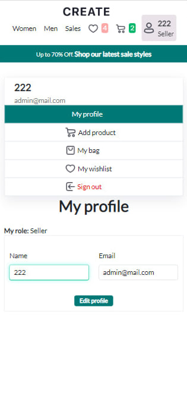
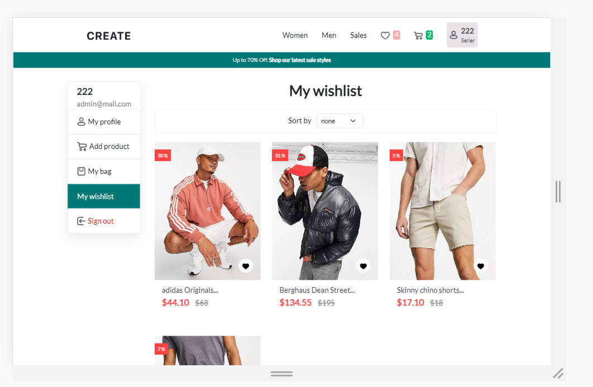

## Full-stack MERN application "Online-store"

Technologies: MERN stack (MongoDB, Express.js, React, Node.js), TypeScript, Redux-Toolkit, SCSS.

Multi-page application with different functionality for different users.

User roles:

1. The **customer** can add products to the bag and wishlist, checkout and change user data. Data is stored in MongoDB.
2. The **seller** can add products for sale. Data is stored in _MongoDB_.
3. The **guest** can add products to the bag and wishlist. Data is stored in _localStorage_.

## Main Page

 
 

## Collections (sorting+filtering)

 
  

## SignIn/SingUp

 
  

## Product Card

 
 

## Forms (adding a product and editing a profile)

 
 

## Bag

 
 

## Wishlist

